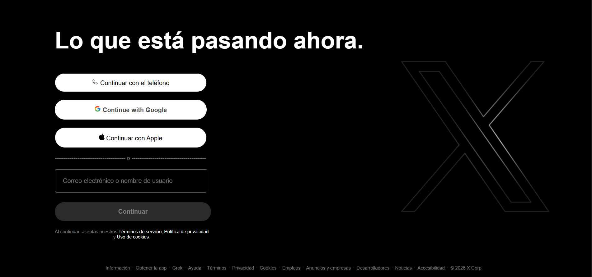

TWITTER / X Clone.
 

The goal is to clone Twitter/X login and feed interface frontend.

Tech Stack: 
HTML5: Structure and containers. 
CSS3: Custom styling and gradients.
Flexbox: Complex layouts and alignment.

What I Learned:
I discovered the use of the containers and Flexbox since to make everything I didn't know that firstly I have to see the interface in boxes.
