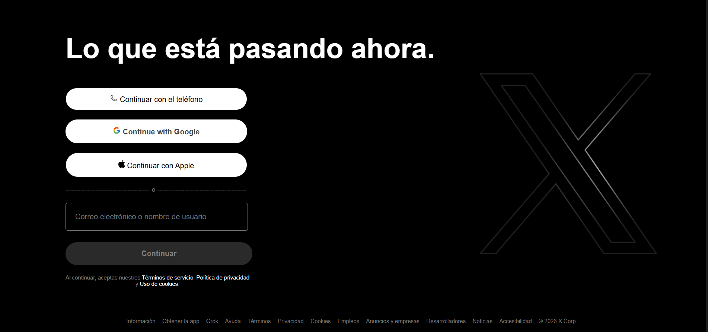
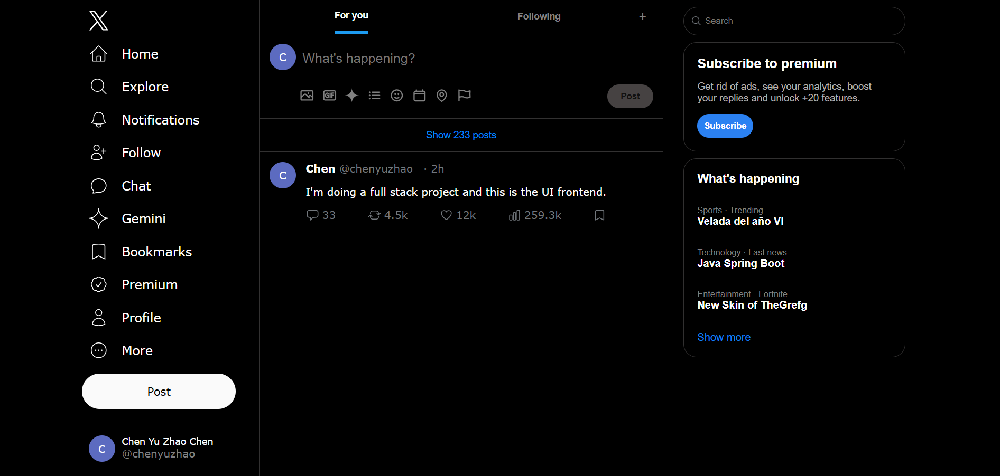

TWITTER / X Clone.
 

The goal is to clone Twitter/X login and feed interface frontend.

Tech Stack: 
HTML5: Structure and containers. 
CSS3: Custom styling and gradients.
Flexbox: Complex layouts and alignment.

What I Learned:
I discovered the use of the containers and Flexbox since to make everything I didn't know that firstly I have to see the interface in boxes.

### Phase 2: Full-Stack Integration
Now it is dynamic, Client-Side Rendered web application powered by a Java REST API.

**Expanded Tech Stack:**
*   **Backend:** Java 21, Spring Boot, Spring Data JPA
*   **Database:** PostgreSQL
*   **Frontend Logic:** Vanilla JavaScript, Fetch API, DOM Manipulation
*   **Architecture:** RESTful API design, Client-Side Rendering

**Core Features Implemented:**
*   **Dynamic Timeline (GET):** JavaScript fetches the array of tweets from PostgreSQL and dynamically injects the HTML onto the screen.
*   **Like System (PUT):** Users can interact with dynamic DOM elements to update specific rows in the database.
*   **Create Tweets (POST):** Users can capture input text, package it into a JSON payload, and send it to the Java backend to be saved permanently.
